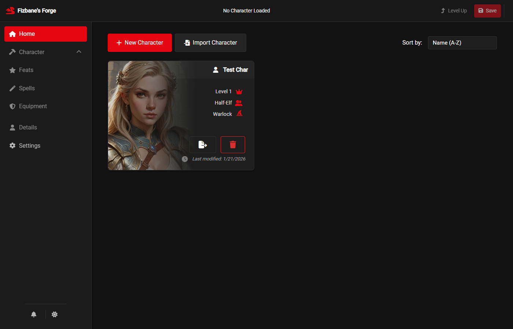
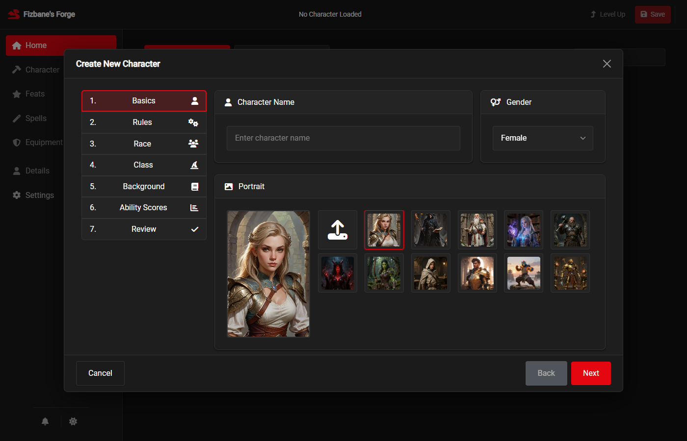
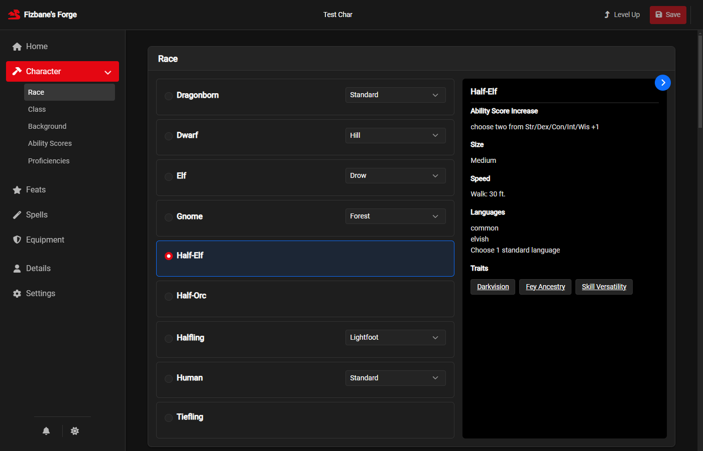
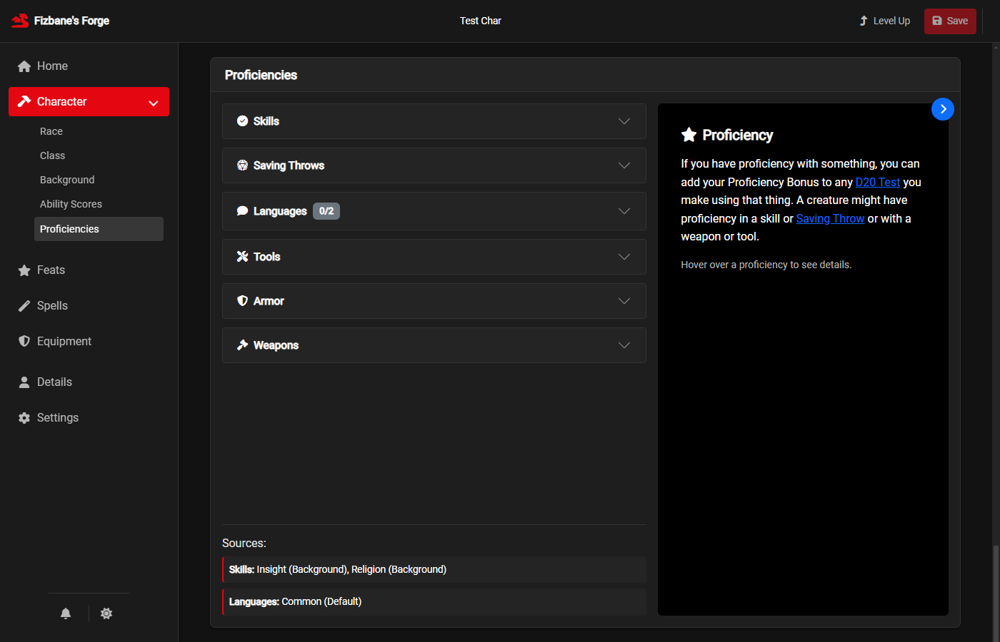
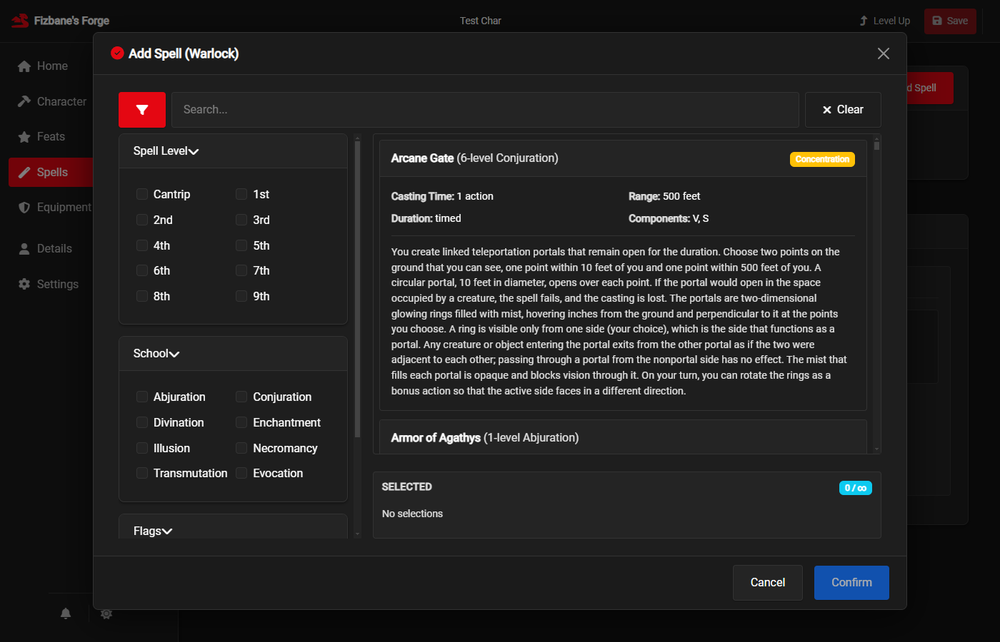

# Fizbane's Forge

<div align="center">


**A comprehensive Dungeons & Dragons 5th Edition character creator**

[](https://www.electronjs.org/)
[](https://getbootstrap.com/)
[](license.txt)
[](https://wiki.tercept.net/en/home)

</div>

## ✨ Features

- **Step-by-step character creation** — Race, class, background, and ability scores with source filtering
- **Level-up wizard** — Multiclassing, ASI/feat selection, and automatic feature detection
- **Spell management** — Class spell lists, preparation, and multiclass slot calculation
- **Equipment & inventory** — Item management with encumbrance tracking
- **Multiple ability score methods** — Point Buy, Standard Array, Rolling, or Manual Entry
- **Character details** — Portraits, backstory, and physical characteristics

## 📸 Screenshots

<details>
<summary>📋 Home - Character List</summary>


*Manage all your characters in one place with sorting options*

</details>

<details>
<summary>🧙 Character Creation Wizard</summary>


*Step-by-step character creation with source filtering*

</details>

<details>
<summary>🏗️ Character Builder</summary>


*Edit race, class, background, ability scores, and proficiencies*

</details>

<details>
<summary>📈 Level Up</summary>


*Level-up wizard with class features, ASI/feats, and spell selection*

</details>

<details>
<summary>📊 Proficiencies</summary>


*Track armor, weapon, tool, skill, and language proficiencies*

</details>

<details>
<summary>🎆 Spell Selection</summary>


*Browse and add spells with filtering by level, school, and class*

</details>

## 🚀 Getting Started

### Option 1: Download Release (Recommended)

1. Download the latest `.exe` from the [Releases](../../releases) page
2. Run the portable executable — no installation required

### Option 2: Build from Source

**Prerequisites:** [Node.js](https://nodejs.org/) (LTS recommended)

```bash
git clone https://github.com/kevinkickback/fizbanes-forge.git
cd fizbanes-forge
npm install
npm start
```

## 📊 Data Files

> **⚠️ Important:** Fizbane's Forge does **not** include D&D game data. You must provide your own compatible JSON files.

This application uses the [5etools](https://wiki.tercept.net/en/home) data format. On first launch, you will be prompted to select a folder/URL containing compatible JSON files.


## 📄 License

This project is licensed under the GNU General Public License v3.0 - see the [license.txt](license.txt) file for details.